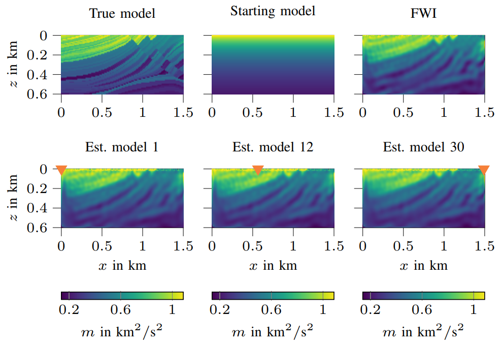

# Frequency-Domain Adapt-Then-Combine Full Waveform Inversion

This repository implements the Frequency-Domain Adapt-Then-Combine Full Waveform Inversion (FD-ATCFWI) with Tikhonov and total variation regularization for distributed, high-resolution subsurface imaging in seismic networks.
As long as the seismic network graph is connected, each receiver in the network obtains a subsurface image locally via data exchange with directly connected receivers. 

The code uses GMRES to solve the Helmholtz equation with 2nd Clayton-Enquist boundary conditions. The forward solver is a Python version of the Helmholtz solver implemented in [Fast Helmholtz solver](https://github.com/vkazei/fastHelmholtz/).

<p align=center>

</p>

The figure shows reconstruction of the Marmousi benchmark model at different receivers.

## Running the script
The main file is `FWIHELM_MAIN.py` where you can select the algorithm (`FWI`or `ATCFWI`) and the subsurface model (`two_ellipses` or `marmousi`). In `config.py` predefined parameter and simulation settings are stored which are loaded by the script.
If you want to play with parameter settings, you can do that there.

**Note:** Running the ATCFWI can result in very long (several hours) simulation time. Therefore, this option should be chosen after deciding for a proper simulation machine or time of the day!

## Requirements
- numpy
- matplotlib
- scipy
- scikit-image
- joblib
- pyprind

## Citation
If you use (parts of) this code for your work, please consider citing the following papers:

```
@article{Shin2025a,
  author = {Shin, Ban-Sok and Shutin, Dmitriy},
  title = {Distributed Full Waveform Inversion in the Frequency Domain for Seismic Networks},
  journal = {IEEE Geoscience and Remote Sensing Letters},
  year={2025}
}

@inproceedings{Shin2025b,
  author = {Shin, Ban-Sok and Shutin, Dmitriy},
  title = {Distributed Subsurface Imaging with Tikhonov and Total Variation Regularization for Seismic Networks},
  booktitle = {European Signal Processing Conference (EUSIPCO)},
  year={2025}
}
```
